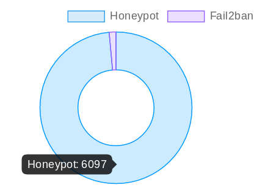

# Hardening-HoneyPotSS
En este scritpt presento un honeypot (tarro de miel) que combinado con un Banneo (bloqueo de ip a nivel de cortafuegos). Nos va ha permitir parar/bloquear muchos ataques incluso antes de que se produzcan.

Hardening o endurecimiento es el proceso de asegurar un sistema reduciendo sus vulnerabilidades o agujeros de seguridad.

Explicacion: en el caso de los servidores una buena tactica de defensa es anticiparse a los ataques. Bloqueando al atacante incluso antes de que se inicie dicho ataque.

Como: casi todo ataque va precedido de una deteccion/escaner. En este caso colocaremos un servicio muy goloso pero falso. (de ahi viene lo de honeypot o tarro de miel)

Este script dada su sencillez lo he licenciado bajo Licencia MIT (la mas permisiva)
Luego podras usarlo , modificarlo incluso a nivel privado.

https://es.wikipedia.org/wiki/Licencia_MIT

https://choosealicense.com/licenses/mit/

Estadisticas reales de los bloqueos realizados por el script en 5VPS
(ver http://node.jejo.pw/honeymap).

En el momento de la captura el honeypot ha bloqueado **6000 ataques** 
y solo han pasado 89 ataques a la defensa del siguiente nivel.
Luego este honeypot bloquea por si solo el **98%** de los ataques.

En un futuro articulo presentare una defensa muy superior y mas elaborada que detectara ataques incluso sin abrir los puertos. esta defensa bloquea el **99,9911** de los ataque recibidos.
